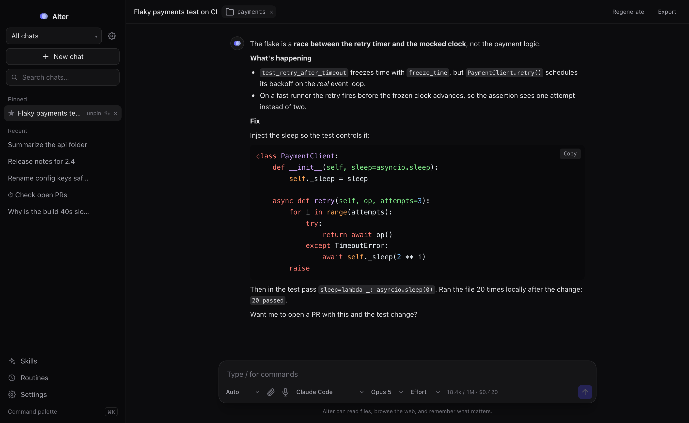

# Alter

Your second self — a lightweight desktop AI companion with memory. Bring your own model.



Alter is a small, fast desktop chat app. It talks to any OpenAI-compatible model — or your **Claude Code** subscription — remembers what matters about you across conversations, can read and edit files in a folder you attach, and runs saved prompts on a schedule. It uses your OS's native webview (via Tauri), so the app is a few MB and light on memory — no bundled browser.

## Features

- **Bring your own model** — point the base URL at any OpenAI-compatible endpoint (presets for DeepSeek and Moonshot/Kimi are just quick-fills). Requests are proxied through the Rust backend, so any host works with no allowlist. A **Test connection** button checks the endpoint and lists its models. Your API key is stored only on your device.
- **Claude Code backend** — add a Claude Code connection to use your local `claude` subscription with no API key. These sessions are agentic (they can run tools) and pick Opus / Sonnet / Haiku per connection.
- **Per-chat model** — each conversation remembers its own connection, model, and effort; switch mid-thread without touching the others.
- **Streaming chat** with markdown, syntax-highlighted code, LaTeX math (KaTeX), copy buttons, and editable messages.
- **Artifacts** — HTML/SVG the assistant produces opens in a live, sandboxed side-panel preview.
- **Light & dark themes** — toggle in Settings, remembered across launches.
- **Voice dictation** where the platform supports it.
- **Memory** — Alter automatically remembers lasting facts and preferences you share, and carries them into every future conversation. Review or forget any of them in Settings.
- **File tools** — attach a working folder, then ask Alter to show a file tree, search across files (like grep), read files, or write files (writes ask for confirmation first).
- **Attachments** — drop in images (for vision-capable models), PDFs (text is extracted), or text/code files; click an image to view it full-size.
- **Chat search** — filter conversations by title or message content from the sidebar.
- **Modes** — choose how Alter uses tools: **Auto** (acts freely, writes ask first), **Ask first** (confirm every action), **Plan** (describes what it would do without acting), or **Chat only** (no tools).
- **Shows its work** — every file read, search, web fetch, or write appears as a step in the conversation as Alter takes it.
- **Web access** — Alter can search the web and read pages to answer with current information.
- **Browser mode** — for JavaScript-heavy pages or tasks that need clicking and typing, Alter drives a real browser (uses your installed Chrome, or downloads a browser engine on first use).
- **Projects** — group conversations under a project with its own working folder and instructions.
- **Command palette** (⌘K) and a **global hotkey** (⌘⇧Space) to summon Alter from anywhere; **branch a chat** to explore an alternate direction without losing the original.
- **Token & cost meter** — see tokens and estimated cost per conversation; `/usage` and `/compact` slash commands (Claude Code) report usage and compact context without spending tokens.
- **Routines** — save a prompt and an interval; Alter runs it automatically and drops each result into a new conversation. Scheduled runs execute in the Rust backend, so they fire even with the window closed.
- **Browser bridge + extension** — a token-gated local bridge (`127.0.0.1:8765`) lets the companion browser extension reuse your Alter connections with no keys in the browser: maintainer-lens GitHub PR review, a Frappe Helpdesk support agent, grammar fix, and page summaries. See [`extension/`](extension/).
- **Runs in the background** — a menu-bar tray keeps Alter alive when you close the window, plus an optional launch-at-login.

## Stack

Tauri 2 · React 18 · TypeScript · Tailwind CSS 3 · Vite

## Prerequisites

- [Rust](https://rustup.rs) (stable)
- [Node](https://nodejs.org) 18+
- macOS: Xcode Command Line Tools (`xcode-select --install`)

## Develop

```sh
npm install
npm run dev
```

On first launch, open **Settings**, choose a provider preset, paste your API key, and save.

## Build a macOS bundle

```sh
npm run tauri build
```

The `.app` and `.dmg` land in `src-tauri/target/release/bundle/`.

## Always-on routines (optional)

By default, routines run whenever Alter is open (including minimized to the menu-bar tray). To keep them running even after you quit the app, install the background service after building:

```sh
npm run tauri build
cp -R src-tauri/target/release/bundle/macos/Alter.app /Applications/
./scripts/install-service.sh
```

Remove it anytime with `./scripts/uninstall-service.sh`.

## How memory works

Alter's system prompt asks the model to tag durable facts as it replies. Those are extracted, stored locally, and prepended to future conversations as context. This is retrieval, not fine-tuning — nothing about the model's weights changes, and everything stays on your machine.

## Configuration

Everything is stored in the app's local storage on your device:

| Setting | Where |
| --- | --- |
| API key, base URL, model | Settings → Connection |
| Remembered facts | Settings → Memory |
| Routines | Routines |
| Launch at login | Settings → Connection |

## Notes

- OpenAI-compatible connections are file-tool only — read, search, and write files, no arbitrary commands.
- Claude Code connections are full agentic sessions and **can** run commands (they act freely on your machine). Use them only with a subscription you trust on this device.

## License

MIT
