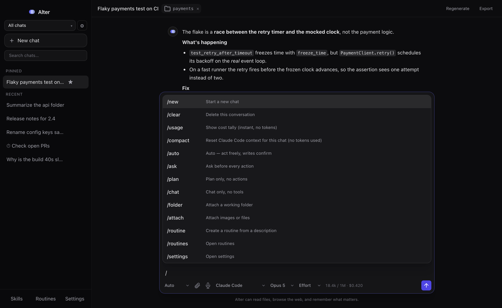
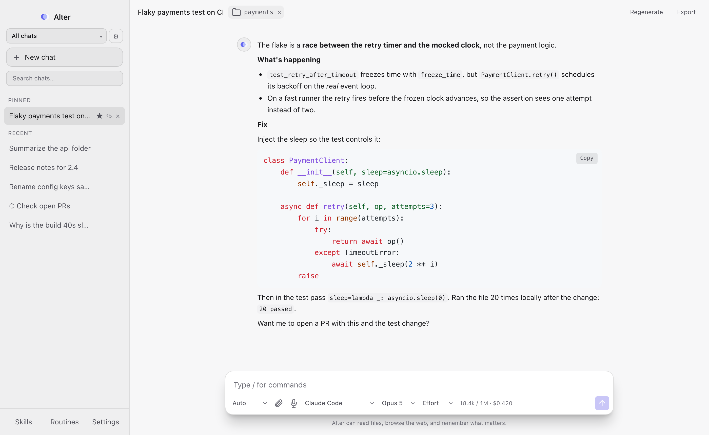

# Alter

A small, fast desktop AI companion that remembers you. Bring your own model, or use your Claude Code subscription.


Alter is a native desktop chat app built on Tauri, so it is a few MB and light on memory. It talks to any OpenAI-compatible endpoint or drives the local `claude` CLI, keeps long-term memory across conversations, works inside a folder you attach, runs saved prompts on a schedule, and ships with a browser extension that reuses your Alter connections on GitHub and Frappe Helpdesk without putting a single API key in the browser.

## Highlights

**Models**
- Any OpenAI-compatible endpoint. Presets for DeepSeek, Moonshot/Kimi, Gemini and OpenRouter are quick-fills, not an allowlist. Requests go through the Rust backend, so any host works.
- **Claude Code** as a backend: add one connection and use your `claude` subscription with no key. Each chat keeps a warm `claude` process, so follow-ups are instant and chats never interrupt each other. Pick Opus, Sonnet or Haiku and an effort level per chat.
- Per-chat connection, model and effort. Automatic fallback to another saved connection when the active one is down.
- Context meter in the composer: tokens used against the model's window, plus session cost.

**Chat**
- Streaming markdown with syntax-highlighted code, KaTeX math, tables and collapsible details, in light and dark themes.
- **Esc interrupts** the current turn at its next step and keeps everything done so far in the chat. Typing while a turn runs queues the message and delivers it at the next step, the same way Claude Code does.
- Attach images (persisted to disk), PDFs and text files. Drag and drop or paste.
- Branch a chat, regenerate, edit messages, export to Markdown, search across chats, pin favourites.
- Artifacts: HTML and SVG the assistant produces open in a sandboxed side panel.

**Agent**
- Modes: **Auto** (acts freely, writes confirm), **Ask first**, **Plan** (no actions) and **Chat only**.
- File tools on an attached folder: tree, grep, read, write. Web search and page reading. Every step shows in the conversation as it happens.
- Tool outputs are carried into later turns, so "now use that to…" works on every provider.
- **Skills**: save reusable instructions in the app, or use your Claude Code skills from `~/.claude/skills` and `~/.claude/commands`. Both appear in the slash menu, so `/fix-issue 123` works inside Alter.



**Memory**
- Alter asks the model to tag durable facts as it replies, extracts them, and carries them into every future conversation. Review or forget any of them in Settings.
- The same facts are appended to `~/.claude/CLAUDE.md`, so Claude Code learns them too, and a new Claude Code chat is seeded with what you told Alter.

**Automation**
- **Routines**: a prompt plus a schedule (interval, daily, weekly). Each run lands in its own chat. Runs execute in the Rust backend, so they fire with the window closed, and optionally as a login service.
- **Projects** group chats under a folder and standing instructions.
- ⌘K command palette, ⌘⇧Space global hotkey, menu-bar tray, launch at login.

**Browser extension**
- A token-gated bridge on `127.0.0.1` lets the companion extension use your Alter connections. No keys in the browser.
- GitHub: a maintainer-lens PR review with a plain-English verdict, verify-on-bench, and a draft comment in your own voice.
- Frappe Helpdesk: summarize, diagnose and draft replies on a ticket, then hand off to a full Alter chat or prepare a fix on a local branch for your review.
- Grammar fix on any editable field, page summaries from the popup.
- Details and setup in [`extension/`](extension/README.md).



## Quick start

Prerequisites: [Rust](https://rustup.rs) (stable), [Node](https://nodejs.org) 18+, and on macOS the Xcode Command Line Tools (`xcode-select --install`).

```sh
npm install
npm run dev
```

On first launch open **Settings**, pick a provider preset and paste a key, or add a **Claude Code** connection (needs the `claude` CLI on your PATH, logged in). **Test connection** checks the endpoint and lists its models.

Build a bundle with `npm run tauri build`. The `.app` and `.dmg` land in `src-tauri/target/release/bundle/`.

## Settings worth knowing

| Setting | What it does |
| --- | --- |
| Connections | One entry per provider or Claude Code. Keys stay on your device. |
| Agent working folder | Where browser-triggered agents run (PR review, support, prepare fix). Usually your bench or repo. |
| Frappe credentials | Site URL and API key/secret so the support agent's `fr` reads from the environment instead of the keychain. |
| Repro benches | Per-version bench folders the support agent can reproduce bugs on. |
| Memory | Everything Alter remembers, with delete. |
| Browser bridge | The pairing token for the extension. |
| Theme, launch at login | Under Settings. |

## Slash commands

`/new`, `/clear`, `/usage`, `/compact`, `/auto`, `/ask`, `/plan`, `/chat`, `/folder`, `/attach`, `/routine <description>`, `/routines`, `/settings`, plus every saved skill and every Claude Code skill as `/<name> <args>`.

## Always-on routines

Routines run whenever Alter is open, including in the tray. To keep them running after you quit, install the background service after building:

```sh
npm run tauri build
cp -R src-tauri/target/release/bundle/macos/Alter.app /Applications/
./scripts/install-service.sh
```

Remove it with `./scripts/uninstall-service.sh`.

## Security notes

- OpenAI-compatible connections get file tools only: read, search and write inside the attached folder, no shell.
- Claude Code connections are full agentic sessions and **can run commands**. Auto mode runs them without prompts. Use Ask or Plan mode when you want to approve each step.
- Browser-triggered agents run under an allowlist: read-only `fr` and `gh`, read-only git (push, config, reset, commit and the like are denied), plus a scoped bench reproduction helper. This is a gate, not a sandbox.
- Everything (chats, memory, settings, attachments) is stored locally. Nothing leaves your machine except requests to the providers you configured.

## Stack

Tauri 2 · Rust · React 18 · TypeScript · Tailwind CSS · Vite

## License

MIT
